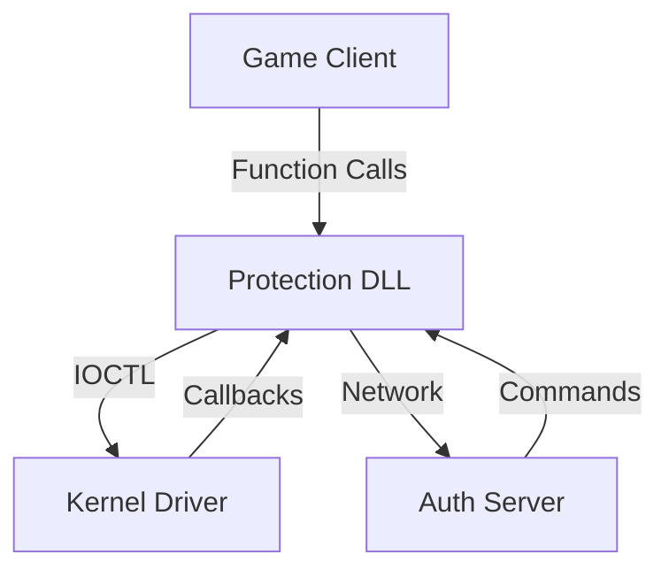

# ps14 Architecture Document

**Anti-Tamper Game Engine - System Design Specification**  
**Version:** 1.0  
**Last Updated:** August 23, 2026  
**Author:** Mistral Vibe

---

## 📋 TABLE OF CONTENTS

1. [Overview](#overview)
2. [System Requirements](#system-requirements)
3. [Architecture Diagram](#architecture-diagram)
4. [Component Details](#component-details)
5. [Security Threat Model](#security-threat-model)
6. [Communication Protocols](#communication-protocols)
7. [Data Structures](#data-structures)
8. [Performance Considerations](#performance-considerations)
9. [Error Handling](#error-handling)
10. [Future Enhancements](#future-enhancements)

---

## 🎯 OVERVIEW

### Purpose

The ps14 Anti-Tamper Game Engine provides kernel-level and user-mode protection for PC games against:
- Memory tampering (health, ammo, score manipulation)
- Code injection (DLL injection, function hooking)
- Reverse engineering (debugger attachment, disassembly)
- Client-server desynchronization attacks
- Buffer overflow exploits

### Design Goals

| Goal | Description |
|------|-------------|
| **Security** | Prevent unauthorized access and modification |
| **Performance** | Minimal impact on game FPS (< 1% overhead) |
| **Reliability** | No false positives, stable operation |
| **Stealth** | Hard to detect and bypass |
| **Maintainability** | Clean, modular, well-documented code |

### High-Level Architecture

The system consists of three main layers:

```
┌─────────────────────────────────────────────────────────────────┐
│                    LAYER 3: KERNEL DRIVER                         │
│  (Ring 0 - Highest Privilege)                                      │
│  ┌──────────────────┐  ┌──────────────────┐  ┌────────────────┐ │
│  │ Memory Guardian  │  │ Process Watcher  │  │ Callback Handler│ │
│  │ - Page Protection │  │ - Injection Det. │  │ - Violation Resp│ │
│  │ - Shadow PT Det.  │  │ - Thread Monitor │  │ - Access Control│ │
│  └──────────────────┘  └──────────────────┘  └────────────────┘ │
└─────────────────────────────────────────────────────────────────┘
                              │
                              │ IOCTL / Shared Memory
                              ▼
┌─────────────────────────────────────────────────────────────────┐
│                    LAYER 2: PROTECTION DLL                         │
│  (Ring 3 - User Mode)                                               │
│  ┌──────────────────┐  ┌──────────────────┐  ┌────────────────┐ │
│  │ Memory Monitor   │  │ Integrity Checker│  │ Auth Handler   │ │
│  │ - Async Auditing │  │ - File Hashing   │  │ - Session Mgmt │ │
│  │ - Page Scanning   │  │ - Code Signing   │  │ - Token Val.   │ │
│  └──────────────────┘  └──────────────────┘  └────────────────┘ │
│  ┌──────────────────┐  ┌──────────────────┐                     │
│  │ State Synchronizer│  │ Repair System    │                     │
│  │ - Conflict Res.   │  │ - Memory Fix     │                     │
│  │ - State Tracking  │  │ - File Restore   │                     │
│  └──────────────────┘  └──────────────────┘                     │
└─────────────────────────────────────────────────────────────────┘
                              │
                              │ API Hooks / Function Interception
                              ▼
┌─────────────────────────────────────────────────────────────────┐
│                    LAYER 1: GAME CLIENT                            │
│  (Original Game Process)                                          │
│  ┌─────────────────────────────────────────────────────────────┐ │
│  │  Game Engine (Unmodified)                                   │ │
│  │  - Rendering, Physics, AI, etc.                             │ │
│  └─────────────────────────────────────────────────────────────┘ │
└─────────────────────────────────────────────────────────────────┘
                              │
                              │ Network (TCP/IP or Custom Protocol)
                              ▼
┌─────────────────────────────────────────────────────────────────┐
│                    LAYER 4: AUTH SERVER                           │
│  (Remote or Local)                                                 │
│  ┌──────────────────┐  ┌──────────────────┐  ┌────────────────┐ │
│  │ Authentication   │  │ State Verification│  │ Ban System     │ │
│  │ - Login/Logout   │  │ - Sync Validation │  │ - Cheater DB    │ │
│  │ - Token Gen.     │  │ - Conflict Res.   │  │ - IP Tracking   │ │
│  └──────────────────┘  └──────────────────┘  └────────────────┘ │
└─────────────────────────────────────────────────────────────────┘
```

---

## 📋 SYSTEM REQUIREMENTS

### Hardware Requirements

| Component | Minimum | Recommended |
|-----------|---------|-------------|
| CPU | Dual-core 2 GHz | Quad-core 3 GHz+ |
| RAM | 4 GB | 8 GB+ |
| Storage | 100 MB | 1 GB |
| OS | Windows 10 (1809+) | Windows 11 |
| Architecture | x86-64 | x86-64 |

### Software Requirements

**Development:**
- Visual Studio 2022 (Community or higher)
- Windows SDK (latest)
- Windows Driver Kit (WDK) for Windows 11
- CMake 3.20+
- Git

**Runtime:**
- .NET Framework 4.8+ (for configuration tool)
- Visual C++ Redistributable 2022

**Kernel Driver Signing:**
- Test certificate (free from Microsoft for development)
- Production certificate (paid, ~$100-500/year)

---

## 🏗️ ARCHITECTURE DIAGRAM

### Data Flow

```
┌─────────────┐     ┌─────────────┐     ┌─────────────┐
│   Game      │────▶│  Protection  │────▶│   Kernel    │
│   Process   │     │     DLL     │     │   Driver    │
└─────────────┘     └─────────────┘     └─────────────┘
         │                    │                    │
         │ Game API Calls     │ IOCTL Requests     │ Hardware Access
         ▼                    ▼                    ▼
┌─────────────┐     ┌─────────────┐     ┌─────────────┐
│  Game State  │     │  Memory Scan │     │  Memory     │
│  Changes     │     │  Results     │     │  Protection │
└─────────────┘     └─────────────┘     └─────────────┘
         │                    │                    │
         └────────────────────┴────────────────────┘
                              │
                              ▼
                     ┌─────────────────┐
                     │  Auth Server    │
                     │  (Remote)       │
                     └─────────────────┘
```

### Component Interaction



---

## 🧩 COMPONENT DETAILS

### 1. Memory Monitor (User Mode)

**Location:** `src/core/memory_monitor/`

**Responsibilities:**
- Scan process memory for unauthorized modifications
- Maintain hash database of protected regions
- Detect code and data tampering
- Trigger repair actions

**Key Files:**
- `memory_scanner.c` - Memory scanning logic
- `page_auditor.c` - Memory page auditing
- `hash_database.c` - Hash storage and lookup
- `thread_pool.c` - Async auditing threads

**Algorithm:**
```
1. Initialize protected memory regions from configuration
2. Calculate initial hashes for all regions
3. Store hashes in database
4. Start async auditing thread pool
5. For each region:
   a. Calculate current hash
   b. Compare with stored hash
   c. If mismatch: trigger alert and repair
6. Repeat at configured interval
```

**Configuration:**
```json
{
  "audit_interval_ms": 100,
  "thread_count": 4,
  "protected_regions": [
    {
      "name": "player_health",
      "address": "0x12345678",
      "size": 4,
      "hash_algorithm": "crc32"
    }
  ]
}
```

### 2. Integrity Checker (User Mode)

**Location:** `src/core/integrity_check/`

**Responsibilities:**
- Verify file integrity (EXE, DLL, configs)
- Validate code signatures
- Detect file tampering
- Prevent execution of modified binaries

**Key Files:**
- `file_verifier.c` - File hash verification
- `code_signature.c` - Digital signature validation
- `checksum_db.c` - Known-good hash database

**Supported Hash Algorithms:**
- CRC32 (fast, for runtime checks)
- SHA-256 (secure, for critical files)
- MD5 (l
